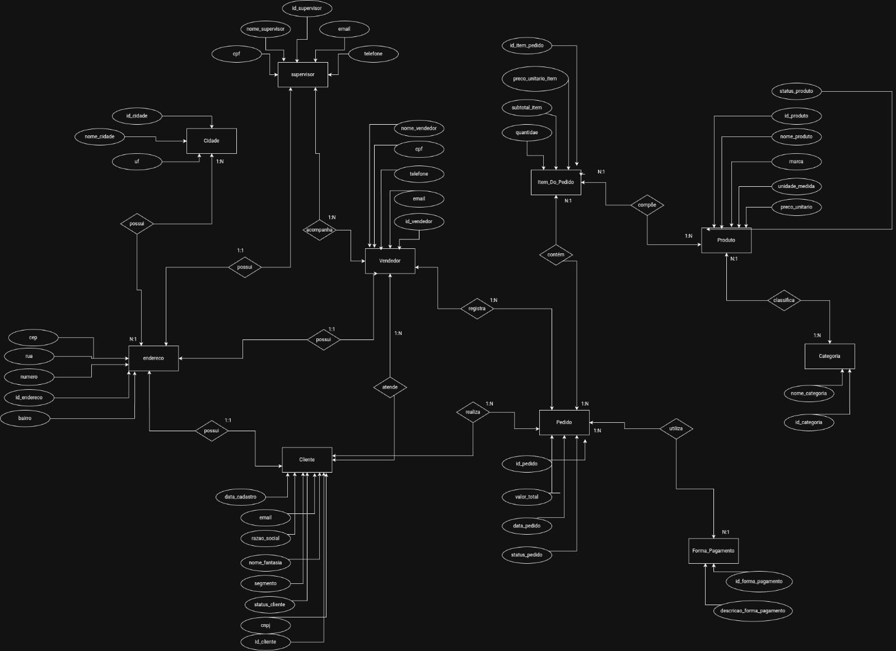

# Distribuidora Alpha | SQL e banco de dados relacional

Projeto de fundamentos de SQL com modelagem relacional e consultas comerciais em SQLite para uma distribuidora fictícia de alimentos e bebidas.

## Sobre o projeto

A Distribuidora Alpha atende pequenos e médios comércios de quatro cidades. O projeto organiza clientes, equipe comercial, produtos e pedidos para investigar vendas e relacionamentos entre essas entidades.

O objetivo é demonstrar a tradução de regras de negócio em tabelas, chaves e consultas SQL. A base é demonstrativa: contém 10 clientes, 12 produtos, 6 vendedores, 2 supervisores, 13 pedidos e 43 itens de pedido. Os pedidos abrangem janeiro a abril de 2025.

## Problema de negócio

- Qual é o faturamento total, mensal e por vendedor ou supervisor?
- Qual é o ticket médio dos pedidos faturados?
- Quais produtos vendem mais unidades e quais categorias geram mais faturamento?
- Quais clientes não possuem pedidos faturados e quais estão inativos no cadastro?
- Como as vendas se distribuem por cidade, segmento e forma de pagamento?

## Modelagem de dados

O [schema SQL](sql/01_schema.sql) implementa dez tabelas:

| Tabelas | Função e relacionamentos |
| --- | --- |
| `cidade`, `endereco` | Cada endereço pertence a uma cidade. |
| `supervisor`, `vendedor` | Cada vendedor está associado a um supervisor; ambos possuem endereço. |
| `cliente` | Cada cliente possui endereço e vendedor responsável pela carteira. |
| `categoria`, `produto` | Cada produto pertence a uma categoria. |
| `forma_de_pagamento`, `pedido` | Cada pedido referencia cliente, vendedor e forma de pagamento. |
| `item_pedido` | Liga um pedido a um produto e registra quantidade, preço praticado e subtotal. |

As tabelas possuem chaves primárias inteiras e relacionamentos definidos por chaves estrangeiras. O modelo utiliza `NOT NULL`, `UNIQUE` e `CHECK` para restringir campos obrigatórios, identificadores cadastrais, status e valores. O vínculo com endereço é obrigatório e único dentro de cada uma das tabelas `cliente`, `vendedor` e `supervisor`; isso não estabelece exclusividade entre as três tabelas.



O [DER original](assets/data-model.jpeg) apresenta a modelagem conceitual. Os nomes físicos e as restrições efetivamente implementadas estão no schema SQL.

## Estrutura do repositório

```text
projeto-sql-distribuidora-alpha/
|-- README.md
|-- sql/
|   |-- 01_schema.sql
|   |-- 02_seed_data.sql
|   `-- 03_analysis_queries.sql
|-- docs/
|   `-- projeto-distribuidora-alpha.pdf
`-- assets/
    `-- data-model.jpeg
```

O [PDF original](docs/projeto-distribuidora-alpha.pdf) documenta o cenário, as funções operacionais e a modelagem conceitual. Ele inclui hipóteses de porte da empresa e possibilidades futuras, como logística e fornecedores, que não representam funcionalidades implementadas. Os 220 clientes e 95 produtos mencionados no cenário não são as quantidades da carga demonstrativa.

## Tecnologias

- SQL e SQLite para definição das tabelas, carga e consultas.
- Draw.io para o DER, conforme registrado no README original.
- Git e GitHub para versionamento e publicação.

## Fluxo do projeto

1. Definição do cenário e modelagem das entidades e relacionamentos.
2. Criação das tabelas com [01_schema.sql](sql/01_schema.sql).
3. Carga dos dados demonstrativos com [02_seed_data.sql](sql/02_seed_data.sql).
4. Exploração e análise com [03_analysis_queries.sql](sql/03_analysis_queries.sql).

## Principais análises

O script contém 38 consultas, organizadas em oito grupos:

| Grupo | Conteúdo |
| --- | --- |
| Exploração | Clientes, produtos, pedidos, vendedores e supervisores. |
| Indicadores gerais | Faturamento, quantidade de pedidos faturados e ticket médio. |
| Equipe comercial | Faturamento e pedidos por vendedor, supervisão e ticket médio por vendedor. |
| Clientes e carteira | Vínculos cadastrais, clientes atendidos, valor comprado, número de compras e inatividade. |
| Período | Faturamento e pedidos por mês. |
| Pagamento | Uso e faturamento por forma de pagamento. |
| Produtos | Quantidades vendidas, faturamento por produto, categoria e marca, média dos subtotais por categoria. |
| Localização e segmento | Faturamento por cidade e segmento, pedidos por segmento. |

As métricas de vendas consideram apenas pedidos com status `Faturado`. O ticket médio é calculado por pedido. A frequência de compra representa o número de pedidos faturados na base, sem normalização por tempo. A média por categoria é a média dos subtotais das linhas de itens, não o preço médio unitário.

Inatividade cadastral e ausência de compras são recortes distintos: a segunda consulta procura clientes sem nenhum pedido faturado na base, sem definir uma janela de recência. Consultas com `INNER JOIN` apresentam somente entidades com correspondência no recorte analisado. Algumas consultas repetem métricas como exercício didático e foram preservadas.

### Exemplos de SQL

Faturamento dos pedidos concluídos:

```sql
SELECT
    SUM(p.valor_total) AS faturamento_total
FROM pedido p
WHERE p.status_pedido = 'Faturado';
```

Clientes sem pedidos faturados:

```sql
SELECT
    c.id_cliente,
    c.nome_fantasia
FROM cliente c
LEFT JOIN pedido p
    ON c.id_cliente = p.id_cliente
   AND p.status_pedido = 'Faturado'
WHERE p.id_pedido IS NULL;
```

## Como executar

É necessário um ambiente SQLite 3. Os comandos abaixo utilizam o executável `sqlite3` disponível no terminal. Abra o terminal na raiz deste repositório e inicie um banco novo:

```text
sqlite3 :memory:
```

No prompt do SQLite, execute:

```sql
.bail on
.headers on
.mode column
.read sql/01_schema.sql
.read sql/02_seed_data.sql
.read sql/03_analysis_queries.sql
PRAGMA foreign_key_check;
PRAGMA integrity_check;
```

Os comandos iniciados por ponto pertencem ao terminal SQLite. Em um editor gráfico compatível, execute o conteúdo dos três arquivos na mesma conexão, nessa ordem, sem os comandos iniciados por ponto.

O banco `:memory:` é temporário e desaparece ao encerrar a sessão. Para persistir os dados, substitua `:memory:` por um caminho de arquivo novo fora do repositório. Os scripts criam tabelas e inserem IDs fixos; não devem ser executados novamente sobre um banco já carregado. O schema e a carga ativam `PRAGMA foreign_keys = ON`; em novas conexões que alterem dados, ative essa opção novamente.

### Resultado de referência

Na carga fornecida, as consultas devem retornar:

| Indicador | Resultado |
| --- | ---: |
| Pedidos faturados | 11 |
| Faturamento total | 1.392,90 |
| Ticket médio, arredondado para apresentação | 126,63 |

Os outros dois pedidos são um cancelado e um pendente. `foreign_key_check` não deve retornar linhas e `integrity_check` deve retornar `ok`.

## Escopo e limitações

Este é um exercício de fundamentos, sem aplicação operacional, controle de estoque ou integração externa. Os dados reduzidos servem para demonstrar consultas; não sustentam conclusões sobre uma empresa real.

Os valores monetários usam `REAL`, preservando o modelo original, e podem apresentar diferenças de representação decimal. Totais e subtotais são armazenados explicitamente: o schema não os recalcula nem garante automaticamente que correspondam à soma dos itens. Na carga fornecida, essas correspondências foram verificadas. O preço do item representa o valor praticado no pedido e pode diferir do preço cadastrado no produto.

O banco registra os vínculos atuais de cadastro, sem histórico de mudanças de carteira ou supervisão. As verificações de data, CPF e CNPJ são limitadas; não constituem validação cadastral completa.

## Competências demonstradas

- Modelagem de entidades e relacionamentos.
- Criação de tabelas, chaves primárias, chaves estrangeiras e restrições.
- Inserção de dados respeitando dependências.
- Consultas com `JOIN`, `LEFT JOIN`, `GROUP BY`, `ORDER BY`, `COUNT`, `SUM` e `AVG`.
- Agregação temporal com `strftime` e distinção entre métricas de pedido e item.
- Tradução de perguntas comerciais em consultas SQL.

## Aprendizados

Este foi um projeto inicial da minha formação. Seu desenvolvimento permitiu praticar a relação entre modelagem, integridade dos dados e definição de indicadores. A manutenção preserva esse propósito, tornando a organização e as instruções de execução mais claras.
