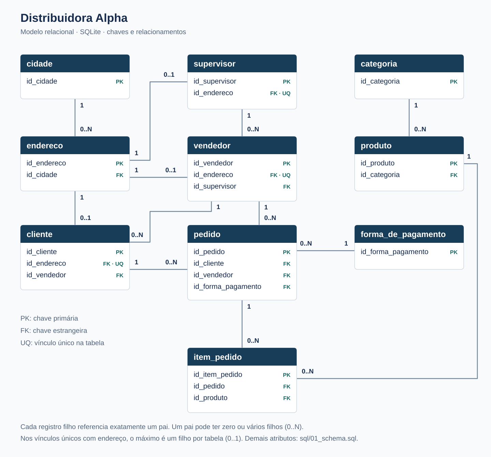

# Distribuidora Alpha | SQL e banco de dados relacional

Projeto de fundamentos de SQL para uma distribuidora fictícia de alimentos e bebidas. Demonstra modelagem relacional, integridade referencial e consultas de vendas em SQLite.

A base demonstrativa contém 10 clientes, 12 produtos, 6 vendedores, 2 supervisores, 13 pedidos e 43 itens. Os pedidos abrangem janeiro a abril de 2025.

## Perguntas de negócio

- Quanto foi faturado por mês, vendedor e supervisor?
- Qual é o ticket médio dos pedidos faturados?
- Quais produtos e categorias têm maior participação nas vendas?
- Quais clientes estão inativos no cadastro ou não possuem compras faturadas?
- Como as vendas se distribuem por cidade, segmento e forma de pagamento?

## Modelo de dados



[Ampliar o diagrama](assets/data-model.svg). A imagem apresenta as dez tabelas, suas chaves e os doze relacionamentos. Os demais atributos, tipos e restrições estão no [schema SQL](sql/01_schema.sql).

Cada pedido referencia um cliente, um vendedor e uma forma de pagamento. Seus itens relacionam produtos, quantidades e preços praticados. Produtos pertencem a categorias; vendedores estão vinculados a supervisores. Clientes, vendedores e supervisores possuem endereços associados a cidades.

O modelo utiliza chaves primárias e estrangeiras, `NOT NULL`, `UNIQUE` e `CHECK`. O endereço é obrigatório e único dentro de cada tabela de cliente, vendedor ou supervisor; não existe exclusividade entre essas três tabelas.

## Arquivos e tecnologias

```text
projeto-sql-distribuidora-alpha/
|-- README.md
|-- sql/
|   |-- 01_schema.sql
|   |-- 02_seed_data.sql
|   `-- 03_analysis_queries.sql
`-- assets/
    `-- data-model.svg
```

SQL e SQLite são utilizados na criação, carga e consulta do banco. Git e GitHub mantêm o histórico. O diagrama é uma imagem vetorial em SVG, baseada no schema implementado.

## Consultas e resultados

O [script de análise](sql/03_analysis_queries.sql) contém 38 consultas: exploração cadastral; indicadores gerais; desempenho comercial; carteira e compras por cliente; evolução mensal; formas de pagamento; produtos, categorias e marcas; cidades e segmentos. Algumas agregações se repetem como exercício didático.

As métricas de vendas consideram somente pedidos `Faturado`. Na carga fornecida:

| Indicador | Resultado |
| --- | ---: |
| Pedidos faturados | 11 |
| Faturamento total | 1.392,90 |
| Ticket médio por pedido | 126,63 |

**Leituras da base demonstrativa:**

- **Vendas por mês:** março apresenta o maior faturamento, 389,20, com três pedidos. Abril registra 311,60, com dois pedidos, mas seu ticket médio é maior: 155,80 contra 129,73 em março. Faturamento menor não significa necessariamente pedidos de menor valor. O recorte é pequeno e não permite afirmar tendência ou sazonalidade.
- **Participação por categoria:** Mercearia Seca soma 674,70, aproximadamente 48,4% do faturamento. Essa concentração descreve o mix da amostra; sem dados de custo, não é possível concluir que seja a categoria mais lucrativa.
- **Clientes sem compras:** Sabor Mineiro é o único cliente sem pedido faturado e também está inativo no cadastro. A coincidência ocorre nesta carga, mas as regras são diferentes: status é uma informação cadastral; ausência de compra é verificada nos pedidos. Sem uma janela de recência, o resultado não mede abandono de clientes.

A frequência de compra conta pedidos faturados na base, sem normalização por tempo. A média por categoria usa subtotais de linhas de itens, não preços unitários. Consultas com `INNER JOIN` exibem apenas entidades com correspondência no recorte.

### Exemplos de SQL

Faturamento dos pedidos concluídos:

```sql
SELECT
    SUM(p.valor_total) AS faturamento_total
FROM pedido p
WHERE p.status_pedido = 'Faturado';
```

Clientes sem pedidos faturados:

```sql
SELECT
    c.id_cliente,
    c.nome_fantasia
FROM cliente c
LEFT JOIN pedido p
    ON c.id_cliente = p.id_cliente
   AND p.status_pedido = 'Faturado'
WHERE p.id_pedido IS NULL;
```

## Como executar

Utilize SQLite 3. Na raiz do repositório, abra um banco temporário com o executável `sqlite3` disponível no terminal:

```text
sqlite3 :memory:
```

No prompt do SQLite, execute os arquivos na ordem:

```text
.bail on
.headers on
.mode column
.read sql/01_schema.sql
.read sql/02_seed_data.sql
.read sql/03_analysis_queries.sql
PRAGMA foreign_key_check;
PRAGMA integrity_check;
```

`foreign_key_check` deve retornar zero linhas; `integrity_check`, `ok`. Em um editor gráfico compatível, execute o conteúdo dos três arquivos na mesma conexão, sem os comandos iniciados por ponto.

O banco temporário desaparece ao encerrar a sessão. Para persistir dados, substitua `:memory:` por um caminho de arquivo novo fora do repositório. Os scripts não são destinados à reexecução em um banco já carregado. Schema e carga ativam `PRAGMA foreign_keys = ON`; ative também essa opção em novas conexões que alterem dados.

## Escopo e limitações

Este projeto inicial da minha formação demonstra modelagem, junções e agregações aplicadas a perguntas comerciais. A amostra fictícia serve para estudar SQL, sem representar resultados de uma empresa real.

Os valores monetários usam `REAL`, sujeito a imprecisão decimal. Totais e subtotais são armazenados explicitamente: foram conferidos na carga, mas não são recalculados automaticamente pelo schema. O preço praticado no item pode diferir do preço cadastrado no produto.

O banco não mantém histórico de mudanças de carteira ou supervisão. As validações de datas, CPF e CNPJ são limitadas. Controle de estoque, custos e aplicação operacional estão fora do escopo.
